# Assignment1 in mobileapplication group 15

# Meal-App

This project is a group assignment for NTNU course IDATA2503, where we are to build an Meal app. I will heavily follow a [udemy](https://www.udemy.com/course/learn-flutter-dart-to-build-ios-android-apps/?couponCode=24T4MT90924A) course and add my own features on top of that.

- [The feature that is added](#The-feature-that-is-added)
- [User stories](#user-stories)
- [Folders And files Structure](#folders-and-files-structure)
- [Class Diagram](#class-diagram)

## The feature that is added

1)	Added a new screen called all_meals. That displays all meals and sorts them by price, difficulty, and duration. It takes in a list just like categories and sort the list depending on what the sorted options wants. The filter function does also apply to the all_meals screen.

2)	Sorting, added a sorting algorithm (this one can be improved) to rank the Enums based on the difficulty and price. Then re arranged the meals in the list to follow the required order.

3)	Added the all_ meals screen to the navigation bar, with its own icon. That will change screen using the same logic as to the meals and favorite screen.

4)	Now it is possible to favorite the meal from the meal_item widgets, which will work just like the favorites in the meal screen. The star icon does also swap, and update. Because the riverpod watch and read library was used. The notification bar does also work when favoriting and unfavoriting from the widgets.

5)	Notifications are now improved, making them able to tell which meal was added or removed from favorites.

I created a timer that will count the amount of time the user spends on the quiz.
The only classes that was changed was quiz.dart, results_screen.dart. I added a time_widget.dart file,
that is a widget to display the time. 

## User-stories

User 1 – I wish there was a way for me to see all the meals. It is a bit bothering to go through all the categories each time I am looking for a meal

User 2 – It is nice that I can filter away the meals that has ingredients I cannot eat or don’t want to include, but I wish there was a way to also sort the meals by how pricy, how difficult and how long it takes to cook the meal.

User 3 – I want the app to add functions so I can favorite the meal when I see the widget of it, I don’t want to go into the whole meal every time I want to add it to favorite

User 4 – Sometimes when I am favoriting an item, I’m not sure which one was added to favorites. Is there a way the app could notify me about what meal was added and removed?

## Folders And Files Structure

### Data:
Data folder contains the data that is stored in the application, like the meals and category. 

### Providers:
The provider folder contains files that handle the logic and follows the state of the widgets. In the case of this app, the files that uses riverpod to check state and content of the items used in the application.

### Screens:
The folder screens contain the classes that uses scaffold and other libraries to display content on the whole screen.

### Widgets:
Widget folder contains the widget classes that is used in the application, often by the screens. An example is the meal widgets and the drawer widgets.

### Main:
The main file is the main class that takes in the tabs screen and starts the whole app.

## Class Diagram

```mermaid
classDiagram
class App
App : +build() Widget
StatelessWidget <|-- App

class Category
Category : +id String
Category : +title String
Category : +color Color
Category o-- Color

class Meal
Meal : +id String
Meal : +categories List~String~
Meal : +title String
Meal : +imageUrl String
Meal : +ingredients List~String~
Meal : +steps List~String~
Meal : +duration int
Meal : +complexity Complexity
Meal o-- Complexity
Meal : +affordability Affordability
Meal o-- Affordability
Meal : +isGlutenFree bool
Meal : +isLactoseFree bool
Meal : +isVegan bool
Meal : +isVegetarian bool

class Complexity
<<enumeration>> Complexity
Complexity : +index int
Complexity : +values$ List~Complexity~
Complexity : +simple$ Complexity
Complexity o-- Complexity
Complexity : +challenging$ Complexity
Complexity o-- Complexity
Complexity : +hard$ Complexity
Complexity o-- Complexity
Enum <|.. Complexity

class Affordability
<<enumeration>> Affordability
Affordability : +index int
Affordability : +values$ List~Affordability~
Affordability : +affordable$ Affordability
Affordability o-- Affordability
Affordability : +pricey$ Affordability
Affordability o-- Affordability
Affordability : +luxurious$ Affordability
Affordability o-- Affordability
Enum <|.. Affordability

class FavoriteMealsNotifier
FavoriteMealsNotifier : +toggleMealFavoriteStatus() bool
StateNotifier <|-- FavoriteMealsNotifier

class FiltersNotifier
FiltersNotifier : +setFilters() void
FiltersNotifier : +setFIlter() void
StateNotifier <|-- FiltersNotifier

class Filter
<<enumeration>> Filter
Filter : +index int
Filter : +values$ List~Filter~
Filter : +glutenFree$ Filter
Filter o-- Filter
Filter : +lactoseFree$ Filter
Filter o-- Filter
Filter : +vegetarian$ Filter
Filter o-- Filter
Filter : +vegan$ Filter
Filter o-- Filter
Enum <|.. Filter

class AllMealsScreen
AllMealsScreen : +availableMeals List~Meal~
AllMealsScreen : +createState() _AllMealsScreenState
StatefulWidget <|-- AllMealsScreen

class _AllMealsScreenState
_AllMealsScreenState : -_selectedSortOption SortOption
_AllMealsScreenState o-- SortOption
_AllMealsScreenState : -_isAscending bool
_AllMealsScreenState : -_sortMeals() void
_AllMealsScreenState : -_changeSortOption() void
_AllMealsScreenState : -_selectMeal() void
_AllMealsScreenState : +build() Widget
State <|-- _AllMealsScreenState

class SortOption
<<enumeration>> SortOption
SortOption : +index int
SortOption : +values$ List~SortOption~
SortOption : +duration$ SortOption
SortOption o-- SortOption
SortOption : +complexity$ SortOption
SortOption o-- SortOption
SortOption : +affordability$ SortOption
SortOption o-- SortOption
Enum <|.. SortOption

class CategoriesScreen
CategoriesScreen : +availableMeals List~Meal~
CategoriesScreen : -_selectCategory() void
CategoriesScreen : +build() Widget
StatelessWidget <|-- CategoriesScreen

class FiltersScreen
FiltersScreen : +build() Widget
ConsumerWidget <|-- FiltersScreen

class MealsScreen
MealsScreen : +title String?
MealsScreen : +meals List~Meal~
MealsScreen : +selectMeal() void
MealsScreen : +build() Widget
StatelessWidget <|-- MealsScreen

class MealsDetailsScreen
MealsDetailsScreen : +meal Meal
MealsDetailsScreen o-- Meal
MealsDetailsScreen : +build() Widget
ConsumerWidget <|-- MealsDetailsScreen

class TabsScreen
TabsScreen : +createState() ConsumerState<TabsScreen>
ConsumerStatefulWidget <|-- TabsScreen

class _TabsScreenState
_TabsScreenState : -_selectedPageIndex int
_TabsScreenState : -_setScreen() void
_TabsScreenState : -_selectPage() void
_TabsScreenState : +build() Widget
ConsumerState <|-- _TabsScreenState

class CategoryGridItem
CategoryGridItem : +category Category
CategoryGridItem o-- Category
CategoryGridItem : +onSelectCategory void Function
CategoryGridItem o-- void Function
CategoryGridItem : +build() Widget
StatelessWidget <|-- CategoryGridItem

class MainDrawer
MainDrawer : +onSelectScreen void FunctionString
MainDrawer o-- void FunctionString
MainDrawer : +build() Widget
StatelessWidget <|-- MainDrawer

class MealItem
MealItem : +meal Meal
MealItem o-- Meal
MealItem : +onSelectMeal void FunctionMeal
MealItem o-- void FunctionMeal
MealItem : +complexityText String
MealItem : +affordability String
MealItem : +build() Widget
ConsumerWidget <|-- MealItem

class MealItemTrait
MealItemTrait : +icon IconData
MealItemTrait o-- IconData
MealItemTrait : +label String
MealItemTrait : +build() Widget
StatelessWidget <|-- MealItemTrait
```

